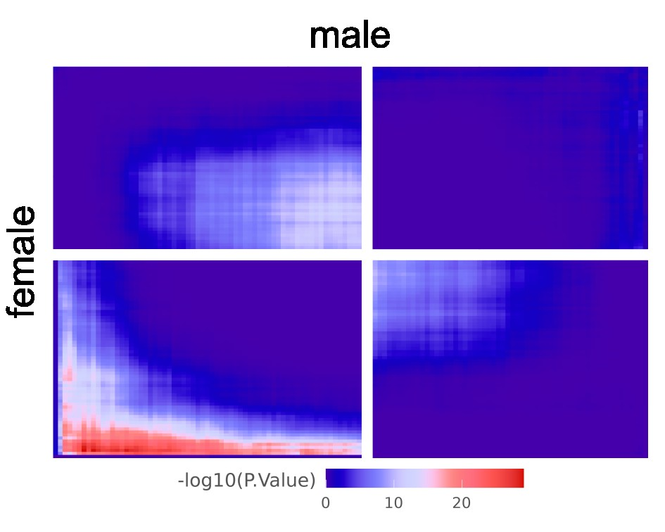

# RRHO2par

We implemented a parallelized version of **RRHO2** ([Cahill et al. 2018](https://doi.org/10.1038/s41598-018-27903-2)). In **RRHO2par** the native **RRHO2** function *numericListOverlap* was modified for parallelisation using the function *mcmapply* of the R package **parallel**.

```{r cars}
library(dplyr)
require(parallel)
require(VennDiagram)
require(RRHO)
```

For each omic, results from differential analysis in each sex were ranked based on the following metric:  

     -log10(p-value) x sign(log2 Fold Change)  

Then, **RRHO2par** was applied to the 2 lists at default parameters (with step size equal to the square root of the list length)

#### Data
We used the R data object *res_single_mRNA.rds* generated by the mRNA single omic analysis (cf. line 187 [/1_Single_Omics/README.md](https://github.com/INSERM-U1141-Neurodiderot/multiomics_MDD/blob/main/1_Single_Omics/README.md))
```{r}
data = readRDS('res_single_mRNA.rds')

female = data$diff_female
male = data$diff_male
rm(data)
```

DDE: -log10(P-value)xFoldChangeSign
```{r }
female$DDE = -log10(female$pvalue) * ifelse(female$log2FoldChange > 0, 1, -1)
female$Genes = rownames(female)
female = female[, c('Genes', 'DDE')]

male$DDE = -log10(male$pvalue) * ifelse(male$log2FoldChange > 0, 1, -1)
male$Genes = rownames(male)
male = male[, c('Genes', 'DDE')]

male = male[male$Genes %in% female$Genes,]
female = female[female$Genes %in% male$Genes,]
```

## Initialization
```{r }
stepsize = RRHO:::defaultStepSize(male, female)
male <- male[order(male[, 2], decreasing = TRUE), ]
female <- female[order(female[, 2], decreasing = TRUE), ]
nmale <- length(male[, 1])
nfemale <- length(female[, 1])
N <- max(nmale, nfemale)

labels = c("male", "female")
boundary = 0.1
```

Computing the overlaps between two *numeric* lists:
```{r }
numericListOverlap<- function(sample1, sample2, stepsize, method="hyper", tol = 0.5, offset = 1 , mcores = ncores){
  n<- length(sample1)
  
  overlap_hyper <- function(a,b) {
    count<-as.integer(sum(as.numeric(sample1[1:a] %in% sample2[1:b])))    
    signs<- 1L
    log.pval<- -phyper(q=count-1, m=a, n=n-a+1, k=b, lower.tail=FALSE, log.p=TRUE)    
    #log.pval[is.na(log.pval)]<-0
    
    return(c(counts=count, 
             log.pval=as.numeric(log.pval),
             signs=as.integer(signs)
    ))    
  }
  
  overlap_fisher <- function(a,b) {
    s1 <- sample1[1:a]
    s2 <- sample2[1:b]
    lenA <- as.integer(sum(as.numeric(s1 %in% s2))) 
    lenB <- length(s1)
    lenC <- length(s2)
    Odds<-((lenA+offset)*(n-lenB-lenC+lenA+offset))/((lenC-lenA+offset)*(lenB-lenA+offset))
    logOdds <- log(abs(Odds))*sign(Odds)
    signs<- 1L
    
    return(c(counts=lenA, 
             log.pval=as.numeric(logOdds),
             signs=as.integer(signs)
    ))    
  }
  
  indexes<- expand.grid(i=seq(1,n,by=stepsize), j=seq(1,n,by=stepsize))
  if(method=="hyper"){
    #overlaps<- apply(indexes, 1, function(x) overlap_hyper(x['i'], x['j']))
    overlaps<- parallel::mcmapply(overlap_hyper , a = indexes[ ,1] , b = indexes[ ,2] , mc.cores = mcores)
  } else if(method=="fisher"){
    #overlaps<- apply(indexes, 1, function(x) overlap_fisher(x['i'], x['j']))
    overlaps<- parallel::mcmapply(overlap_fisher , a = indexes[ ,1] , b = indexes[ ,2] , mc.cores = mcores)
  }
  
  nrows<- sqrt(ncol(overlaps))
  matrix.counts<- matrix(overlaps['counts',], ncol=nrows)  
  matrix.log.pvals<- matrix(overlaps['log.pval',], ncol=nrows)  
  matrix.signs<- matrix(overlaps['signs',], ncol=nrows)  
  
  return(list(counts=matrix.counts, log.pval=matrix.log.pvals, signs = matrix.signs))
}
```

Boundaries
```{r }
.hypermat_normal<- numericListOverlap(male[, 1], female[, 1], stepsize, method='hyper' , mcores = 1)
hypermat_normal<- .hypermat_normal$log.pval

.hypermat_flipX <- numericListOverlap(rev(male[, 1]), female[, 1], stepsize, method='hyper', mcores = 1)
hypermat_flipX <- .hypermat_flipX$log.pval

stepmale <- seq(1, nmale, stepsize)
stepfemale <- seq(1, nfemale, stepsize)

len_male <- length(stepmale)
len_female <- length(stepfemale)

lenStrip_m <- round(len_male*boundary)
lenStrip_f <- round(len_female*boundary)

boundary_m <- sum(male[stepmale,2] > 0)
boundary_f <- sum(female[stepfemale,2] > 0)
```
Initialize matrix
```{r }
hypermat <- matrix(NA, nrow = nrow(hypermat_normal) + lenStrip_m,
                   ncol = ncol(hypermat_normal) + lenStrip_f)
# d1d2, quadrant I
hypermat[lenStrip_m + (boundary_m+1):len_male, lenStrip_f + (boundary_f+1):len_female] <- hypermat_normal[(boundary_m+1):len_male, (boundary_f+1):len_female]

# u1d2, quadrant II
hypermat[1:boundary_m, lenStrip_f + (boundary_f+1):len_female] <- hypermat_flipX[len_male:(len_male - boundary_m + 1),(boundary_f+1):len_female]
  
# u1u2, quadrant III
hypermat[1:boundary_m, 1:boundary_f] <- hypermat_normal[1:boundary_m,1:boundary_f]
  
# u1d2, quadrant IV
hypermat[lenStrip_m + (boundary_m+1):len_male, 1:boundary_f] <- hypermat_flipX[(len_male - boundary_m):1,1:boundary_f]

hypermat <- hypermat * log10(exp(1))
```

dd: down in 1 and down in 2
```{r }
maxind.dd <- which(max(hypermat[lenStrip_m + (boundary_m+1):len_male , lenStrip_f + (boundary_f+1):len_female],
                       na.rm = TRUE) == hypermat, arr.ind = TRUE)
maxind.dd <- maxind.dd[maxind.dd[,1]>=lenStrip_m + (boundary_m+1) & maxind.dd[,1]<=lenStrip_m +len_male & 
                         maxind.dd[,2]>=lenStrip_f + (boundary_f+1) & maxind.dd[,2]<=lenStrip_f + len_female,]

if(!is.null(dim(maxind.dd))){
  maxind.dd <- maxind.dd[1, ]
}

indmale.dd <- seq(1, nmale, stepsize)[maxind.dd[1] - lenStrip_m]
indfemale.dd <- seq(1, nfemale, stepsize)[maxind.dd[2] - lenStrip_f]
gene_male_dd <- male[indmale.dd:nmale, 1]
gene_female_dd <- female[indfemale.dd:nfemale, 1]
gene_list_overlap_dd <- intersect(gene_male_dd,
                                  gene_female_dd)
genelist_dd <- list(gene_male_dd=gene_male_dd, 
                    gene_female_dd=gene_female_dd,
                    gene_list_overlap_dd=gene_list_overlap_dd
)
```
uu: up in 1 and up in 2
```{r }
maxind.uu <- which(max(hypermat[1:boundary_m, 1:boundary_f],
                       na.rm = TRUE) == hypermat, arr.ind = TRUE)
maxind.uu <- maxind.uu[maxind.uu[,1]>=1 & maxind.uu[,1]<=boundary_m & maxind.uu[,2]>=1 & maxind.uu[,2]<=boundary_f,]
if(!is.null(dim(maxind.uu))){
  maxind.uu <- maxind.uu[1, ]
}

indmale.uu <- seq(1, nmale, stepsize)[maxind.uu[1]]
indfemale.uu <- seq(1, nfemale, stepsize)[maxind.uu[2]]
gene_male_uu <- male[1:indmale.uu, 1]
gene_female_uu <- female[1:indfemale.uu, 1]
gene_list_overlap_uu <- intersect(gene_male_uu,
                                  gene_female_uu)
genelist_uu <- list(gene_male_uu=gene_male_uu, 
                    gene_female_uu=gene_female_uu,
                    gene_list_overlap_uu=gene_list_overlap_uu
)
```

ud: up in 1 and down in 2
```{r }
maxind.ud <- which(max(hypermat[1:boundary_m, lenStrip_f + (boundary_f+1):len_female],
                       na.rm = TRUE) == hypermat, arr.ind = TRUE)
#
maxind.ud <- maxind.ud[maxind.ud[,1]>=1 & maxind.ud[,1]<=boundary_m & maxind.ud[,2]>= lenStrip_f + (boundary_f+1) & maxind.ud[,2]<=lenStrip_f + len_female,]
if(!is.null(dim(maxind.ud))){
  maxind.ud <- maxind.ud[1, ]
}

indmale.ud <- seq(1, nmale, stepsize)[maxind.ud[1]]
indfemale.ud <- seq(1, nfemale, stepsize)[maxind.ud[2] - lenStrip_f]
gene_male_ud <- male[1:indmale.ud, 1]
gene_female_ud <- female[indfemale.ud:nfemale, 1]
gene_list_overlap_ud <- intersect(gene_male_ud,
                                  gene_female_ud)
genelist_ud <- list(gene_male_ud=gene_male_ud, 
                    gene_female_ud=gene_female_ud,
                    gene_list_overlap_ud=gene_list_overlap_ud
)
```

du: down in 1 and up in 2
```{r }
maxind.du <- which(max(hypermat[lenStrip_m + (boundary_m+1):len_male, 1:boundary_f],
					 na.rm = TRUE) == hypermat, arr.ind = TRUE)
#
maxind.du <- maxind.du[maxind.du[,1]>=lenStrip_m + (boundary_m+1) & maxind.du[,1]<=lenStrip_m + len_male & maxind.du[,2]>=1 & maxind.du[,2]<=boundary_f,]
if(!is.null(dim(maxind.du))){
maxind.du <- maxind.du[1, ]
}

indmale.du <- seq(1, nmale, stepsize)[maxind.du[1] - lenStrip_m]
indfemale.du <- seq(1, nfemale, stepsize)[maxind.du[2]]
gene_male_du <- male[indmale.du:nmale, 1]
gene_female_du <- female[1:indfemale.du, 1]
gene_list_overlap_du <- intersect(gene_male_du,
								gene_female_du)
genelist_du <- list(gene_male_du=gene_male_du, 
				  gene_female_du=gene_female_du,
				  gene_list_overlap_du=gene_list_overlap_du
)
```

## Best values
get best log10(p-val) of each quadrent
```{r }
max_na_row = which (is.na(hypermat [1,])) %>% max 
max_na_col = which (is.na(hypermat [,1])) %>% max 
min_na_row = which (is.na(hypermat [1,])) %>% min 
min_na_col = which (is.na(hypermat [,1])) %>% min 


best_UU = (as.numeric(unlist(hypermat [1:min_na_row, 1:min_na_col] )) %>% na.omit %>% max )
best_DD = (as.numeric(unlist(hypermat [max_na_row:nrow(hypermat) ,max_na_col:ncol(hypermat)] )) %>% na.omit %>% max )
best_UD = (as.numeric(unlist(hypermat [max_na_row:nrow(hypermat), 1:min_na_col] )) %>% na.omit %>% max ) 
best_DU = (as.numeric(unlist(hypermat [1:min_na_row , max_na_col:ncol(hypermat)] )) %>% na.omit %>% max )

best_UU
best_DD
best_UD
best_DU
```
## Heatmap

```{r }
maximum <- max(hypermat,na.rm=TRUE)
minimum <- min(hypermat,na.rm=TRUE)

color.bar <- function(lut, min, max=-min, 
                      nticks=11, 
                      ticks=seq(min, max, len=nticks), 
                      title='') {
  scale  <- (length(lut)-1)/(max-min)
  plot(c(0,10), c(min,max), type='n', bty='n', 
       xaxt='n', xlab='', yaxt='n', ylab='')
  mtext(title,2,2.3, cex=0.8)
  axis(2, round(ticks,0), las=1,cex.lab=0.8)
  for (i in 1:(length(lut)-1)) {
    y  <- (i-1)/scale + min
    rect(0,y,10,y+1/scale, col=lut[i], border=NA)
  }
}
  

jet.colors  <- colorRampPalette(c("#00007F", "blue", "#007FFF", "cyan", "#7FFF7F", "yellow", "#FF7F00", "red", "#7F0000"))
colorGradient <- jet.colors(101)

layout(matrix(c(rep(1, 6), 2), 1, 7, byrow = TRUE))
  
breaks <- seq(minimum,maximum,length.out = length(colorGradient) + 1)
image(hypermat, col = colorGradient,breaks=breaks,vaxes = FALSE)
  
mtext('female',2,0.5)
mtext('male',1,0.5)
  
color.bar(colorGradient, min = minimum, max = maximum, nticks = 6, title = '-log10(P-value)')
invisible(hypermat)

```

<p align="center">
	
</p>
